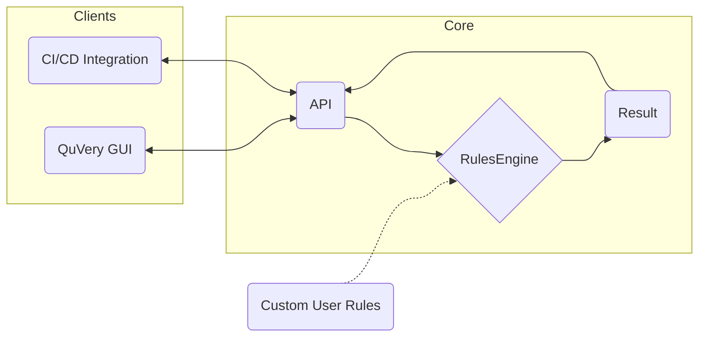

## The Structure of QuVery

Description of the graph:

- **Core**: This is the core of QuVery. It contains the rules engine and the API.
- **Clients**: These are the clients that use QuVery. They can be a CI/CD tool or a GUI.
- **API**: This is the API of QuVery. It's used by the clients to send requests to QuVery.
- **RulesEngine**: This is the rules engine of QuVery. It's used by the API to run the rules.
- **Result**: This is the result of QuVery. It's used by the API to send the result to the client.
- **UserRules**: These are the custom rules that can be added by the user.
